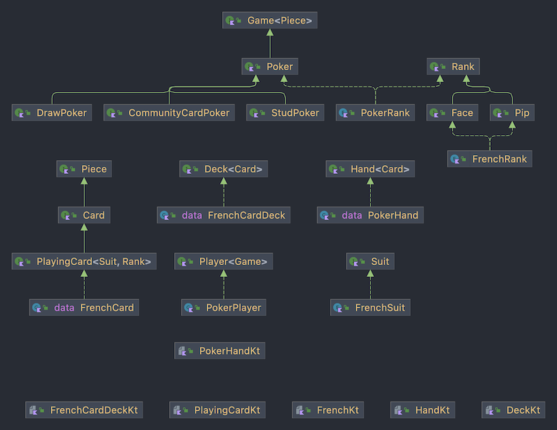

# Playing-cards

A simple implement of playing cards and poker ranking.



## Usage

### getting a instance

You can make a standard playing card (French-suited)
```kotlin
val card = FrenchCard(FrenchSuit.SPADE, FrenchRank.NINE)
println(card) // 9♠

val card0 = FrenchCard(FrenchSuit.DIAMOND to FrenchRank.KING)
println(card0) // K♦
```

#### Deck
```kotlin
val deck = FrenchCardDeck(listOf(FrenchCard(CLUB, ACE), FrenchCard(HEART, JACK)))
println(deck) // [A♣, J♥]

val deck0 = FrenchCardDeck.of(CLUB to ACE, HEART to JACK)

// or just get a standard 52-card deck
val standard52 = FrenchCardDeck.standard52()
println(standard52)
// it is a Bicycle New Deck Order
// [A♠, 2♠, 3♠, 4♠, 5♠, 6♠, 7♠, 8♠, 9♠, 10♠, J♠, Q♠, K♠, 
// A♦, 2♦, 3♦, 4♦, 5♦, 6♦, 7♦, 8♦, 9♦, 10♦, J♦, Q♦, K♦, 
// K♣, Q♣, J♣, 10♣, 9♣, 8♣, 7♣, 6♣, 5♣, 4♣, 3♣, 2♣, A♣, 
// K♥, Q♥, J♥, 10♥, 9♥, 8♥, 7♥, 6♥, 5♥, 4♥, 3♥, 2♥, A♥]

// or handed a specific order
val standard = FrenchCardDeck.standard52(
    listOf(
        SPADE to 1..13,
        HEART to 1..13,
        DIAMOND to 1..13,
        CLUB to 1..13
    )
)
```

#### Hand
`PokerHand` have a hand-ranking property once it is instantiated.
```kotlin
val hand = PokerHand.of(CLUB to TEN, HEART to EIGHT, HEART to QUEEN, SPADE to JACK, CLUB to NINE)
println(hand)
// [10♣, 8♥, Q♥, J♠, 9♣]
// ranking: (STRAIGHT, [Q♥, J♠, 10♣, 9♣, 8♥])
```

### properties and methods

#### Deck
`Deck` is immutable. methods return a new instance not change a state of objects.

```kotlin
val size = deck.size()
val shuffle = deck.shuffle()
val (altDeck: FrenchCardDeck, cards: List<FrenchCard>) = deck.draw(3) 

// or just use minus operator to draw cards
val (altDeck0, cards0) = deck - 5
```

#### Hand
`Hand` is immutable. methods return a new instance not change a state of objects.

```kotlin
val count = hand.count()
val rank: PokerRank? = hand.rank() // STRAIGHT
val rankCards: List<FrenchCard>? = hand.rankCards() // [Q♥, J♠, 10♣, 9♣, 8♥]

val hand1 = hand.add(HEART to THREE)
val hand2 = hand.addAll(HEART to THREE, HEART to TWO)

// or just use operator plus
val hand3 = hand + FrenchCard(HEART to QUEEN)
val hand4 = hand + (SPADE to QUEEN) + (HEART to SEVEN)
```

#### Poker

```kotlin
// there is only ace-high role now
val showdown: Int = Poker.showdown(hand1, hand2)
```

## Todo

- implement Game and Player to play poker games.
- introduce other hand-ranking roles for showdown.